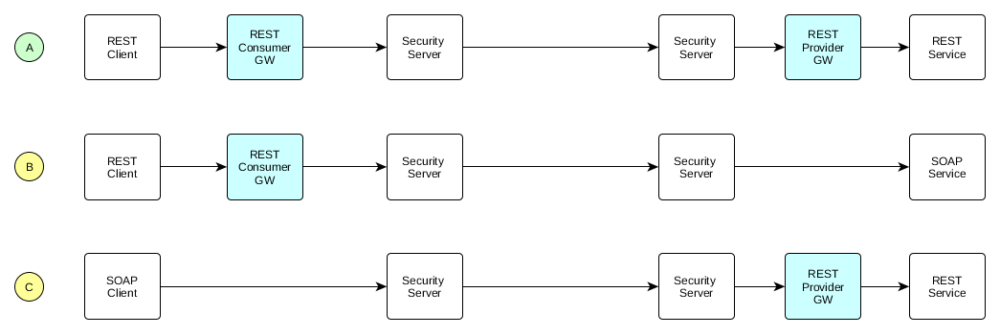

# X-Road REST Adapter Service

REST Adapter Service provides REST support to [X-Road](https://github.com/nordic-institute/X-Road) data exchange layer solution. REST Adapter Service sits between [X-Road](https://github.com/nordic-institute/X-Road) Security Server and a REST client or service ([diagram](https://github.com/nordic-institute/REST-adapter-service/raw/master/images/message-sequence_rest-gateway-0.0.4.png)). The component implements X-Road v4.0 [SOAP profile](https://github.com/nordic-institute/X-Road/blob/develop/doc/Protocols/pr-mess_x-road_message_protocol.md) and it's compatible with X-Road v6.4 and above. 

REST Adapter Service has two parts: _Consumer Gateway_ and _Provider Gateway._ It is possible to use either only Consumer Gateway, only Provider Gateway, or both.



* (A) using both Consumer and Provider Gateways
  * when both the client and the server are REST/JSON, but the messages need to go through X-Road
  * when end to end encryption is needed
* (B) using only Consumer Gateway
  * when the service is SOAP/XML, but a client needs to access it through REST/JSON
* (C) using only Provider Gateway
  * when a REST/JSON service needs to be published in X-Road for SOAP/XML clients

More information about available features can be found [here](documentation/Rest-Adapter-Service-principles.md).

## Try It Out

The fastest and easiest way to try out the application is by using the Spring Boot Maven plugin.
To do this, you need to have a working installation of [Maven](https://maven.apache.org/).


```
cd src
mvn spring-boot:run
```
After that you can access `http://localhost:8080/rest-adapter-service/` to see the Rest Adapter landing page.

If customized properties are used, use the following syntax to define properties directory.
```
mvn spring-boot:run -Drun.jvmArguments="-DpropertiesDirectory=/my/conf"
```

## Configuration files location

Rest Adapter Service tries to load configuration files from the following locations,
in the following order.

If a matching directory exists, all the configuration files
need to exist in that directory, otherwise an error occurs. Configuration
directory scanning stops once the first matching directory is located.

Scanned directories:
1. The directory specified by the system property ```propertiesDirectory```
    ```
    java -jar -DpropertiesDirectory=/my/custom/path rest-adapter-service.war
    ```
2. The directory `rest-adapter-service` in the users home directory (for example `/home/rest-adapter-service/rest-adapter-service`)
3. The directory `/etc/rest-adapter-service` (Linux only)
4. As a fallback, the default configuration shipped with the WAR (classpath)

Alternative configuration locations are mostly relevant only when
starting the executable war from command line,
deploying war into a standalone container,
or running the docker image.
When Rest Adapter Service is installed from DEB- or RPM-packages,
it explicitly sets `/etc/rest-adapter-service` as the configuration directory.

More detailed usage examples are available in [documentation](documentation/Rest-Adapter-Service-principles.md#usage).

# Installing Rest Adapter Service

Rest Adapter Service can be installed and run in a number of ways:
* Using package manager to install DEB- or RPM-packages
* Deploying `rest-adapter-service.war` into a web container such as Tomcat
* Using Docker to run Rest Adapter Service

## Using package manager to install Rest Adapter

### Remove Tomcat dependency used by older versions

If you had previously installed Rest Adapter with version 0.0.12 or earlier, it ran on a standalone Tomcat7 installation.
You may wish to remove the Tomcat installation, as both Tomcat and standalone Rest Adapter run on port 8080 by default and conflict with each other.
If Tomcat was installed automatically as a dependency package, it will be removed with e.g.

```shell
apt-get autoremove
```

Otherwise, use standard `apt` or `yum` commands to remove the `tomcat7` package.

### Ubuntu 14.04 (trusty)

Rest Adapter Service requires `java8-runtime-headless` dependency.
Configure openjdk package repository, which provides that:
```shell
apt-add-repository -y ppa:openjdk-r/ppa
apt-get update
```
Install Java 8:
```shell
apt-get install openjdk-8-jre-headless
```
Do not install Java 9, as Rest Adapter does not yet support it.

Install Rest Adapter Service package from the official repository with
```shell
apt-add-repository -y "deb http://www.nic.funet.fi/pub/csc/x-road/rest-adapter-service/0.0.13/trusty stable main"
curl http://www.nic.funet.fi/pub/csc/x-road/client/ubuntu-dev-current/packages/dists/stable/palveluvayla@gofore.com.asc | sudo apt-key add -
apt-get update
apt-get install rest-adapter-service
```
Configure Rest Adapter Service using property files, see [Rest Adapter Service principles](documentation/Rest-Adapter-Service-principles.md).
Service will automatically start during boot.

### Ubuntu 16.04 (xenial)

Rest Adapter Service requires `java8-runtime-headless` dependency.
Install Java 8:
```shell
apt-get install openjdk-8-jre-headless
```
Do not install Java 9, as Rest Adapter does not yet support it.

Install Rest Adapter Service package from the official repository with
```shell
apt-add-repository -y "deb http://www.nic.funet.fi/pub/csc/x-road/rest-adapter-service/0.0.13/trusty stable main"
curl http://www.nic.funet.fi/pub/csc/x-road/client/ubuntu-dev-current/packages/dists/stable/palveluvayla@gofore.com.asc | sudo apt-key add -
apt-get update
apt-get install rest-adapter-service
```
or from a locally built DEB-package by replacing the package name with the file path in the command above.

Configure Rest Adapter Service using property files, see [Rest Adapter Service principles](documentation/Rest-Adapter-Service-principles.md).
Service is enabled or disabled using system presets.
On a typical Ubuntu 16.04 system it will be *enabled* (and start during boots).

### RHEL 7

Install Rest Adapter Service package from the official repository with
```shell
sudo yum-config-manager --add-repo http://www.nic.funet.fi/pub/csc/x-road/rest-adapter-service/0.0.13/rhel/7/stable
rpm --import http://www.nic.funet.fi/pub/csc/x-road/client/rhel7-dev-current/palveluvayla-sign.gpg
yum install rest-adapter-service
```
or from a locally built RPM-package by replacing the package name with the file path in the command above.

Configure Rest Adapter Service using property files, see [Rest Adapter Service principles](documentation/Rest-Adapter-Service-principles.md).
Service is enabled or disabled using system presets.
On a typical RHEL 7 system it will be *disabled* (and not start during boots).
Enable the service (to start automatically during boots):
```shell
systemctl enable rest-adapter-service
```

### Starting and stopping the service
Starting the service:
```shell
service rest-adapter-service start
```
Stopping the service:
```shell
service rest-adapter-service stop
```

### Changing the port
To change the port, modify configuration file `/etc/rest-adapter-service/application.properties`
```shell
# change this to customize port
server.port=8080
```

### Logs

On Ubuntu 16.04 and RHEL, you can follow the logs using e.g. `journalctl`

```shell
journalctl -fu rest-adapter-service
```

On Ubuntu 14.04 the same can be done using

```shell
tail -f /var/log/upstart/rest-adapter-service.log
```

## Deploying rest-adapter-service web application into a container

You can either build `rest-adapter-service.war` yourself (built war appears in `target/` directory)

```shell
mvn clean install
...
ls -la target/rest-adapter-service-0.0.12-SNAPSHOT.war
-rw-rw-r-- 1 janne janne 22459828 marra  3 16:45 target/rest-adapter-service-0.0.12-SNAPSHOT.war
```

or extract war file from a DEB- or an RPM-package which has been downloaded from the packet repository.
For detailed instructions, [see this page.](documentation/Downloading-WAR-from-repository.md)

To set configuration files location, you need to specify `propertiesDirectory` system property using a container-specific method.

## Using Docker

You can create a docker image to run Rest Adapter inside a container, using the provided Dockerfile.
Before building the image, build the war file inside `src` directory

```
mvn clean install
```
If you have not built the war, building the Docker image will fail with message
```
Step 2 : ADD src/target/rest-adapter-service-*.war rest-adapter-service.war
No source files were specified
```


While you are in the project root directory, build the image using the docker build command. The ```-t``` parameter gives your image a tag, so you can run it more easily later. Don’t forget the ```.``` command, which tells the docker build command to look in the current directory for a file called Dockerfile.

```
docker build -t rest-adapter-service .
```
After building the image, you can run Rest Adapter using it.

```
docker run -p 8080:8080 rest-adapter-service
```

If customized properties are used, the host directory containing the properties files must be mounted as a data directory.
In addition, the directory containing the properties files inside the container must be set using JAVA_OPTS and propertiesDirectory property.

```
docker run -p 8080:8080 -v /host/dir/conf:/my/conf -e "JAVA_OPTS=-DpropertiesDirectory=/my/conf"  rest-adapter-service
```

# Building and packaging

## Source code license headers

The build uses [license-maven-plugin](https://github.com/mycila/license-maven-plugin) to generate proper license headers for the source code files.

`mvn license:format` generates the license headers where they are missing. More details can be found from the plugin documentation.

## DEB-packaging

The Rest Adapter Service builds DEB-packages for Ubuntu using the [jdeb Maven plugin](https://github.com/tcurdt/jdeb).

Different profiles exist for building for Ubuntu 14.04 (Upstart) and Ubuntu 16.04 (Systemd).

Note that when building snapshot versions (i.e. `pom.xml` version string contains `SNAPSHOT`), the resulting package will contain a timestamp to make upgrading existing packages easy.

## Ubuntu 14.04 – trusty (Upstart)

`mvn -f src/pom.xml clean install -P package-trusty`

The package will be generated in `src/target/trusty`.

## Ubuntu 16.04 – xenial (Systemd)

`mvn -f src/pom.xml clean install -P package-xenial`

The package will be generated in `src/target/xenial`.


## RPM-packaging

The Rest Adapter Service can also be packed in an RPM-package for use with RHEL (or derivatives) using the [rpm-maven-plugin](https://github.com/mojohaus/rpm-maven-plugin).
The RPM-packaging can only be run on a RHEL-platform.

```mvn -f src/pom.xml clean install -P package-rpm```

The package will be generated in `src/target/rpm/rest-adapter-service/RPMS/noarch`.

Note that when building snapshot versions (i.e. `pom.xml` version string contains `SNAPSHOT`) the resulting package will contain a timestamp to make upgrading existing packages easy.

## RPM-packaging on a Non-RedHat Platform

It is possible to build RPM-packages even if running on a non-RedHat platform. A docker container can be used for the build.

```shell
# (in the directory which contains pom.xml)
docker build -t rest-adapter-rpm src/main/packages/docker
./build-rpm-in-docker.sh
```


## Encryption of Message Content

Starting from version 0.0.10 Rest Adapter Service supports encryption/decryption of message content. More information and instructions for configuration can be found in the [documentation](documentation/Encryption.md).

By default plaintext configuration is enabled. The software can be built with encryption configuration enabled using the command below.
This setting only affects the default configuration bundled inside the war file, and the integration tests.
External configuration, in `/etc/rest-adapter-service`
or elsewhere, is not affected.

```mvn clean install -Dencrypted```

Running integration tests with plaintext configuration enabled:

```mvn clean install -P itest```

Running integration tests with encryption configuration enabled:

```mvn clean install -P itest -Dencrypted```

### Additional documentation

* [Requirements](documentation/Requirements.md)
* [Setting up development environment](documentation/Setting-up-Development-Environment.md)
* [Setting up SSL on Tomcat](documentation/Setting-up-SSL-on-Tomcat.md)
* [Import a certificate as a trusted certificate](documentation/Import-a-Certificate-as-a-Trusted-Certificate.md)
* [Encryption](documentation/Encryption.md)
* [Rest Adapter Service principles](documentation/Rest-Adapter-Service-principles.md)
* [Obtaining WAR file from package repository](documentation/Downloading-WAR-from-repository.md)
* Examples
  * [Configuring Rest Adapter Service provider](documentation/Configuring-Rest-Adapter-Service-provider.md)
  * [CRUD API configuration](documentation/CRUD-API-Configuration.md)

### Links to material

* [Data exchange layer X-Road](https://github.com/nordic-institute/X-Road)
* [X-Road community](https://x-road.global/)
* [Nordic Institute for Interoperability Solutions (NIIS)](https://www.niis.org/)
* [XRd4J - Java library for X-Road v6](https://github.com/vrk-kpa/xrd4j)

## Want to contribute?

For more information look at the [contribution instructions](CONTRIBUTING.md).

## Credits

The development of REST Adapter Service started as a joint effort between Finland and Estonia in December 2014. Since then the component has been developed by different people and organizations.

* REST Gateway was originally developed by the people listed below (https://github.com/educloudalliance/xroad-rest-gateway) during 2014-2017. 
* The name of the component was changed to REST Adapter Service (https://github.com/vrk-kpa/REST-adapter-service) and it was maintained and further developed by the Finnish Population Register Centre (VRK) during 06/2017-05/2018.
* In June 2018 it was agreed that Nordic Institute for Interoperability Solutions (NIIS) takes maintenance responsibility.

Below is a list of people who initiated the co-operation in a Skype meeting which was held on 18th December 2014:

* Andres Kütt (Estonian Information System Authority, RIA, Estonia)
* Alar Jõeste (Cybernetica, Estonia)
* Margus Freudenthal (Cybernetica, Estonia)
* Petteri Kivimäki (Population Register Centre, Finland)
* Jarkko Moilanen (Ministry of Education and Culture, Finland)
