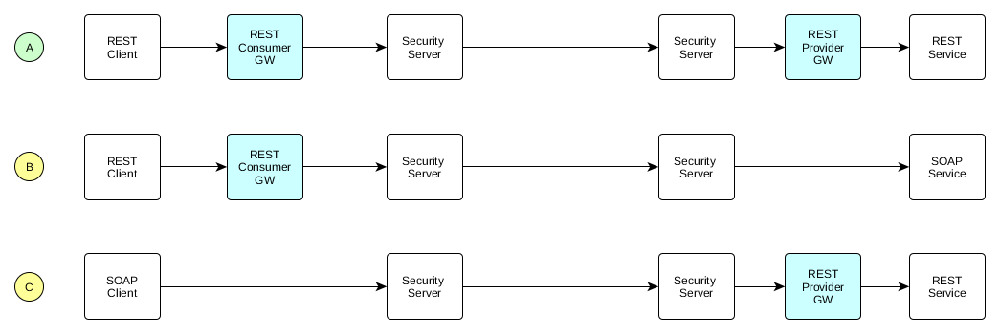

# X-Road REST Adapter Service

[](https://jointxroad.slack.com/)
[](https://x-road.global/community)

REST Adapter Service provides REST support to [X-Road](https://github.com/nordic-institute/X-Road) data exchange layer solution. REST Adapter Service sits between [X-Road](https://github.com/nordic-institute/X-Road) Security Server and a REST client or service ([diagram](https://github.com/nordic-institute/REST-adapter-service/raw/master/images/message-sequence_rest-gateway-0.0.4.png)). The component implements X-Road v4.0 [SOAP profile](https://github.com/nordic-institute/X-Road/blob/develop/doc/Protocols/pr-mess_x-road_message_protocol.md) and it's compatible with X-Road v6.4 and above.

REST Adapter Service has two parts: _Consumer Gateway_ and _Provider Gateway._ It is possible to use either only Consumer Gateway, only Provider Gateway, or both.



* (A) using both Consumer and Provider Gateways
  * when both the client and the server are REST/JSON, but the messages need to go through X-Road
  * when end to end encryption is needed
* (B) using only Consumer Gateway
  * when the service is SOAP/XML, but a client needs to access it through REST/JSON
* (C) using only Provider Gateway
  * when a REST/JSON service needs to be published in X-Road for SOAP/XML clients

More information about available features can be found [here](documentation/Rest-Adapter-Service-principles.md).

## Prerequisites

- Java 21
- [Docker](https://www.docker.com/) or [Gradle](https://gradle.org/)

## Configuration Reference

For running the REST-adapter-service, you have 3 different options:
- Run the docker container using the provided Docker image `niis/rest-adapter-service:x.x.x` at [artifactory](https://artifactory.niis.org/ui/repos/tree/General/xroad-extensions-docker) or [dockerhub](https://hub.docker.com/r/niis/rest-adapter-service) or build the Docker image yourself
- Run the application as gradle bootRun task
- Build the jar file using the gradle buildJar task and run the jar file

To enable communication between service providers and consumers, the REST Adapter Service requires specific configuration files. These files define endpoints, encryption settings, namespaces and further configuration for the service.

### Configuration Files Overview
| File Name                  | Description                                |
|----------------------------|--------------------------------------------|
| providers.properties       | Defines provider endpoints and their settings. |
| provider-gateway.properties| General gateway settings for provider.     |
| consumers.properties       | Defines consumer endpoints and their settings. |
| consumer-gateway.properties| General gateway settings for consumer.     |

For more information on the configuration files, refer to
- [Rest-Adapter-Service-principles](documentation/Rest-Adapter-Service-principles.md)
- [Configuring-REST-adapter-service-provider](Configuring-REST-adapter-service-provider.md)
- [CRUD-API-Configuration](CRUD-API-Configuration.md)

### Configuration Files Locations
In order for REST Adapter Service to work, the configuration must be provided at application startup. This can either be done by placing the configuration files in the default directory or by specifying a custom directory.

Ordered from highest to lowest priority, the configuration options are:
1. Setting a system property
2. Setting an environment variable
3. Placing the files in the default directory

Configuration options explained in detail:
1. For the first option, REST-adapter-service will check for a system property `customPropertiesDir` and uses this directory, if set.
   To set the system property, you can use the following command to run the `jar` file:
    ```shell
     java -DcustomPropertiesDir=<path to properties dir> -jar <path to application>/rest-adapter-service-x.x.x.jar
    ```
   or this command to run the `bootRun` task in Gradle:
    ```shell
     ./gradlew bootRun -PcustomPropertiesDir=<path to properties dir>
    ```
2. Otherwise, you can set the environment variable `REST_ADAPTER_PROPERTIES_DIR` to the directory where the properties files are placed in.
3. By default, the application will try to find the properties files in the directory where the application is started from. 

After that you can access `http://localhost:8080/rest-adapter-service/` to see the Rest Adapter landing page.

### Changing the port

To change the port running the jar file, add `--server.port=<port number>` to the command line, e.g.
```shell
# change this to customize port
java -DcustomPropertiesDir=<path to properties dir> -jar <path to application>/rest-adapter-service-x.x.x.jar --server.port=<port number>
```
To change the port running the `bootRun` task in Gradle, you can add this command line argument `--args='--server.port=<port number>'`, e.g.
```shell
./gradlew bootRun -PcustomPropertiesDir=<path to properties dir> --args='--server.port=9090'
```

## Building and packaging

### Gradle

In order to create the `jar` file, you can use the `bootJar` task to build it. From `/adapter` run
```shell
./gradlew bootJar
```
After that, the `jar` file will be created in `./adapter/build/libs/` directory.

### Docker

If you want to build the Docker image yourself, run from ```/adapter```:
```shell
# in the directory where the Dockerfile is located
docker build -t rest-adapter-service .
```

### Source code license headers

The build uses [license-gradle-plugin](https://github.com/hierynomus/license-gradle-plugin) to generate proper license headers for the source code files.

`./gradlew licenseMain` generates the license headers where they are missing. More details can be found from the plugin documentation.

## Quick start

### Example configuration

To test run the application with example configuration, you can copy the `./adapter/exampleProperties/*.properties.example` as `.properties` files into `<path to properties dir>` and replace the placeholders.

### Running REST-adapter-service using Docker

For running REST-adapter-service using Docker, you can either build the Docker image yourself, or use the release image `niis/rest-adapter-service:x.x.x` on [artifactory](https://artifactory.niis.org/ui/repos/tree/General/xroad-extensions-docker) or [dockerhub](https://hub.docker.com/r/niis/rest-adapter-service)

Please replace `rest-adapter-service` in the command below with the correct image tag that you chose for building locally or use `niis/rest-adapter-service:x.x.x`.
Additionally, replace `<path to properties dir>` with the actual path. Then you can run the Docker image with the following command:

```shell
docker run --name rest-adapter-service \
  -p 8080:8080 \
  -v <path to properties dir>:/app/config:ro \
  rest-adapter-service
```

This will mount your properties directory into the container `/app/config` and start the REST Adapter Service with the provided configuration.

**N.B.!** If you want to **add a wsdl description** for the SOAP converted services, please mount the wsdl directory into the container and replace the placeholders. `<docker path to wsdl file>` needs to be the same path that is referenced in `provider-gateway.properties` file in `wsdl.path`.

```shell
-v <path to wsdl file>:<docker path to wsdl file>:ro \
```


**N.B.!** If you want to **encrypt the communication between adapter consumer and adapter provider**, you first need to set the encrypted property to true in the consumer and provider properties files, more details can be found at [Rest-Adapter-Service-principles](documentation/Rest-Adapter-Service-principles.md). Additionally, you need to mount the keystore files into the container and replace the placeholders. `<docker path to keystores>` needs to match the paths that are referenced in the properties files, e.g. `publicKeyFile` in `provider-gateway.properties`.

```shell 
-v <path to keystores dir>:<docker path to keystores>:ro \
```


### Running REST-adapter-service using Gradle

From `./adapter` directory, run the following command, replacing `<path to properties dir>` with the actual path:

```shell
./gradlew bootRun -PcustomPropertiesDir=<path to properties dir>
```
**N.B.!** Instead of using the command line argument `-PcustomPropertiesDir`, you can also pass the configuration differently, see [Configuration Files Locations](#configuration-files-locations).

### Running REST-adapter-service using `jar` file

After building the jar file, you can start the application using the following command, replacing `<path to properties dir>` and `<path to application>` with the actual paths:
```shell
java -DcustomPropertiesDir=<path to properties dir> -jar <path to application>/rest-adapter-service-x.x.x.jar
```

### Running Integration Tests

Integration tests execute requests against several external API's, such as `http://www.hel.fi/palvelukarttaws/rest/v4/organization/`.
These external API's may for example suffer from temporary downtime, or have their data changed so that integration tests no longer pass.

Integration tests can be run plaintext or encrypted. Plaintext is run by default, if you do not provide a commandline argument like `-PcustomPropertiesDir=<path to properties dir>` or set the environment variable `REST_ADAPTER_PROPERTIES_DIR` to the desired path.
Resourec processing will automatically replace `@projectDir@` and `@rest.adapter.profile.port@` placeholders in the properties files with the actual values.
To run the integration tests with encrypted configuration, you can use the following command from `./adapter` directory:
```shell
./gradlew intTest -PcustomPropertiesDir=src/test/resources/application-intTest-properties/encrypted
```

## Additional documentation

* [Requirements](documentation/Requirements.md)
* [Setting up Development Environment](documentation/Setting-up-Development-Environment.md)
* [Encryption](documentation/Encryption.md)
* [Rest Adapter Service principles](documentation/Rest-Adapter-Service-principles.md)
* [Setup-TLS-on-Docker-Container](documentation/Setup-TLS-on-Docker-Container.md)
* Examples
  * [Configuring Rest Adapter Service provider](documentation/Configuring-Rest-Adapter-Service-provider.md)
  * [CRUD API configuration](documentation/CRUD-API-Configuration.md)

### Links to material

* [Data exchange layer X-Road](https://github.com/nordic-institute/X-Road)
* [X-Road community](https://x-road.global/)
* [Nordic Institute for Interoperability Solutions (NIIS)](https://www.niis.org/)
* [XRd4J - Java library for X-Road v6](https://github.com/nordic-institute/xrd4j)

## Want to contribute?

For more information look at the [contribution instructions](CONTRIBUTING.md).

## Credits

The development of REST Adapter Service started as a joint effort between Finland and Estonia in December 2014. Since then the component has been developed by different people and organizations.

* REST Gateway was originally developed by the people listed below (https://github.com/educloudalliance/xroad-rest-gateway) during 2014-2017.
* The name of the component was changed to REST Adapter Service (https://github.com/vrk-kpa/REST-adapter-service) and it was maintained and further developed by the Finnish Population Register Centre (VRK) during 06/2017-05/2018.
* In June 2018 it was agreed that Nordic Institute for Interoperability Solutions (NIIS) takes maintenance responsibility.

Below is a list of people who initiated the co-operation in a Skype meeting which was held on 18th December 2014:

* Andres Kütt (Estonian Information System Authority, RIA, Estonia)
* Alar Jõeste (Cybernetica, Estonia)
* Margus Freudenthal (Cybernetica, Estonia)
* Petteri Kivimäki (Population Register Centre, Finland)
* Jarkko Moilanen (Ministry of Education and Culture, Finland)
